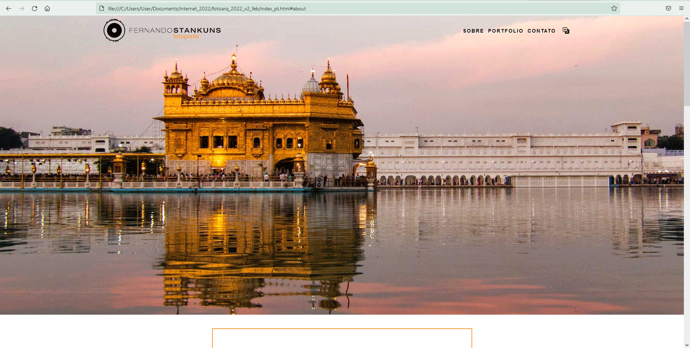

# Project Name
> fotoarq_2022

## Table of contents
* [General info](#general-info)
* [Screenshots](#screenshots)
* [Technologies](#technologies)
* [Status](#status)
* [Inspiration](#inspiration)
* [Contact](#contact)

## General info
It is a website that shows my portfolio of photographs taken over many years.
The website is a way to train and put into practice my skills in web development, in this version using html and css without frameworks.

## Screenshots

## Technologies
* HTML - 5
* CSS - 3

## Status
Project is a work in progress, whether in relation to the photos, or the design of the website, or even in the use of web technologies, with tests and different options for each version.

## Inspiration
This project is inspired by the always help of designer Thomaz Rezende (https://www.thomazrezende.com/v3/), developer Fabio K. Andrade, css teacher Kevin Powell (https://courses.kevinpowell.co/), the photos of Nelson Kon (https://www.nelsonkon.com.br/) and the knowledge of web technologies whose learning is still in progress comes from many places like codecademy (https://www.nelsonkon.com.br/), Leonardo Moura Leitão (https://www.udemy.com/user/leonardomouraleitao/), Bastien Delmare (http://bastiendelmare.com/blog/how-to-build-a-really-simple-responsive-menu/), Tania Rascia (https://www.taniarascia.com/responsive-dropdown-navigation-bar/), Dani Krossing (https://www.youtube.com/watch?v=yytscwxx1pk) and many many others.

## Contact
Created by [@stankuns](https://www.fernando.arq.br/) - feel free to contact me!